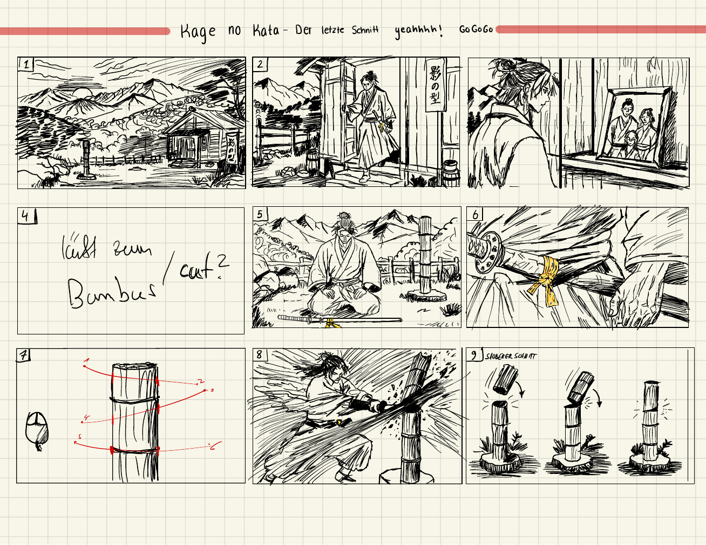

# Kage no Kata - The Final Cut

Interactive computer animation project at the University of Bonn by Julian Meyer and Faouzi Homsani.

The film follows the last heir of a Shinobi sword school during a morning training ritual. The user draws a cut across a bamboo target. Angle, height, direction, and drawing speed drive the sword animation, fracture response, particles, and sound.



## Production Model

Blender provides meshes, UVs, materials, armatures, skin weights, and named animation clips. The C++ application imports glTF 2.0 data, samples keyframes, blends poses, performs GPU skinning, and connects animation with interaction, physics, particles, audio, and rendering.

The runtime targets OpenGL 4.1 on macOS and Windows. The university framework `julcst/gltemplate` v1.7b provides the window, OpenGL context, and GPU resource wrappers.

## Build

```bash
cmake -S . -B build
cmake --build build --config Release
```

CMake fetches the pinned framework version. Visual Studio or Ninja build the project on Windows; Xcode, Make, or Ninja build the same sources on macOS.

## Documentation

- [Story and visual concept](docs/CONCEPT.md)
- [Runtime architecture](docs/TECHNICAL_PLAN.md)
- [Code style](docs/CODE_STYLE.md)
- [Platform independence](docs/PLATFORM_INDEPENDENCE.md)
- [Development log and milestone evidence](docs/DEVELOPMENT_LOG.md)
- [Blender and asset pipeline](docs/ASSET_PIPELINE.md)
- [Interaction design](docs/INPUT_DECISION.md)
- [Requirements, scoring, and ownership](docs/PROJECT_REQUIREMENTS.md)
- [Four-week schedule](docs/TODO.md)

## References

- [Project concept](assets/reference/Kage_no_Kata_Konzept.pdf)
- [Storyboard PDF](assets/reference/Kage_no_Kata_Storyboard.pdf)
- [Official project brief](assets/reference/cgintro-animation-project-info.pdf)
- [Official assessment sheet](assets/reference/cgintro-bewertungsbogen.pdf)

## Current Milestone

The repository contains the agreed architecture, asset contract, feature scope, and delivery schedule. The first runtime milestone loads a GLB test character and plays one skinned animation clip.
