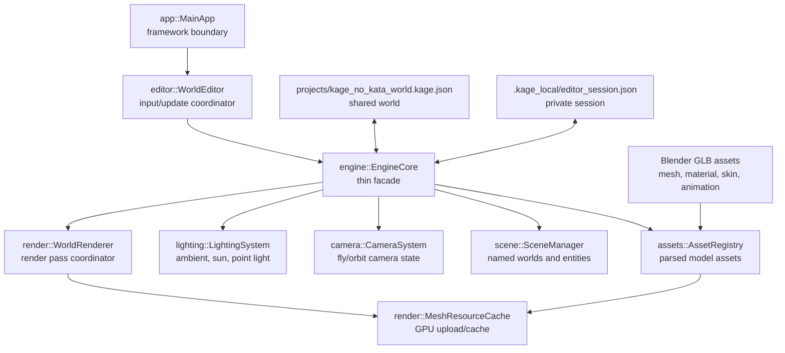

# Engine Architecture

Framework code hosts the application. Project systems own data and behavior.
OpenGL resources stay in `render`.

## System Map

## Ownership

`MainApp`: window lifecycle, input polling, close handling, editor dispatch.

`WorldEditor`: editor input, placement, selection, gizmos, UI.

`EngineCore`: commands, queries, render dispatch, project-system coordination.

`ProjectSerializer`: tracked world load/save and local session load/save.

`AssetRegistry`: parsed GLB/model data and asset library metadata.

`MeshResourceCache`: uploaded GPU resources derived from parsed assets.

`SceneManager`: named worlds, active scene, stable entity ids, selection.

`CameraSystem`: editor fly/orbit camera state. `EditorCameraBridge` mirrors the
active editor camera entity.

## Persistence Model

Tracked world data:
`projects/kage_no_kata_world.kage.json`

Ignored local data:
`.kage_local/editor_session.json`, `.kage_local/imgui.ini`

Autosave writes local data only. Use `Save Project` for tracked world changes.

## Module Rule

- imported data belongs in `assets`;
- world state belongs in `scene`;
- user-facing edit behavior belongs in `editor`;
- GPU state belongs in `render`;
- camera behavior belongs in `camera`;
- cross-system orchestration belongs behind `engine::EngineCore`.
