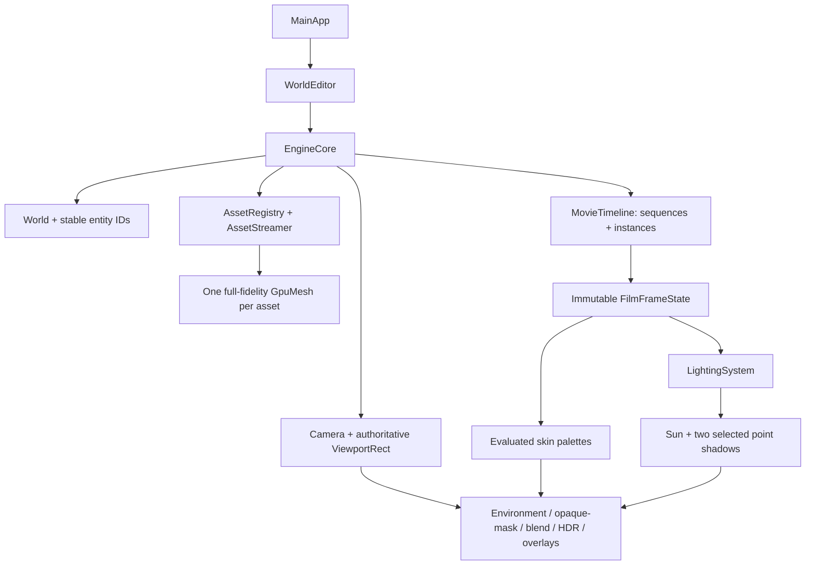

# Architecture

KageEngine has one shared world and two workflows: World Edit constructs it;
Movie evaluates a `MovieTimeline` without changing authored world values.

```mermaid
flowchart TD
  App["MainApp"] --> Editor["WorldEditor"] --> Engine["EngineCore"]
  Engine --> World["World + stable entity IDs"]
  Engine --> Assets["AssetRegistry + AssetStreamer"]
  Assets --> GPU["One full-fidelity GpuMesh per asset"]
  Engine --> Timeline["MovieTimeline: sequences + instances"] --> Frame["Immutable FilmFrameState"]
  Frame --> Animation["Evaluated skin palettes"]
  Frame --> Lighting["LightingSystem"]
  Engine --> View["Camera + authoritative ViewportRect"]
  View --> Renderer["Environment / opaque-mask / blend / HDR / overlays"]
  Animation --> Renderer
  Lighting --> Shadows["Sun + two selected point shadows"] --> Renderer
```

## Ownership

- `World` owns persistent entities and base transforms, cameras, lights, and
  mesh instances.
- Local session data owns the editor camera, fly speed, selection, grid, and
  playhead. Workspace, Shot Preview, and shading reset on launch.
- `MovieTimeline` owns target-specific sequences and their reusable instances.
  Evaluation returns transform, rig, camera, light, and sun overrides without
  mutating `World`.
- `AssetRegistry` owns model metadata. `AssetStreamer` owns CPU loading work.
  All OpenGL creation remains on the main thread.
- `MeshResourceCache` owns one vertex/index allocation and source-resolution
  texture set per asset. There are no generated LODs, proxy textures, or Final
  re-import paths.
- `LightingSystem` extracts evaluated lights and ranks shadow-enabled point
  lights by camera influence, using entity ID as the tie-breaker.
- `WorldRenderer` owns pass order, HDR targets, panorama GPU state, and shadow
  maps. Each pass establishes the GL state it relies on.

## Rendering

Solid, Material, and Final use the complete authored geometry. Bounds is the
only geometry-free mode. Material uses full textures, lighting, and a 2048²
sun shadow. Final uses a stabilized 4096² sun shadow and up to two 1024²
point-light cubemap shadows before HDR tone mapping. Shadow casters are
extracted independently from the camera-visible draw list.

Opaque and masked primitives write depth. Blended primitives render afterwards,
back-to-front, without depth writes. Solid treats every surface as opaque.
Double-sided glTF materials reverse their normal and tangent basis for back
faces. The editor floor is only a translucent depth-tested grid; it never writes
depth and is omitted from film output.

## Persistence

- World schema v6 stores Movie film schema v2: stable sequence, instance, and
  clip IDs; captured bases; movement curves; typed properties; instances; and
  animation trim, speed, loop, and legacy fallback indexes. Legacy film data is
  loader-only and migrates after World entities are available.
- Asset catalog schema v2 stores models, animation packs, and catalogued HDR/LDR
  panoramas.
- Local session schema v4 accepts only finite, normalized, range-checked camera
  state. Older camera state is framed once to prevent legacy bad views.

`FinalRenderJob` renders one UI-free 3840×2160 frame per application frame,
uses 4× MSAA before HDR resolve, retains the PNG sequence, and invokes ffmpeg
only after Bake validation confirms usable camera output, no overlap/orphan or
incompatible target, valid ranges, and resolvable placed animation assets.
