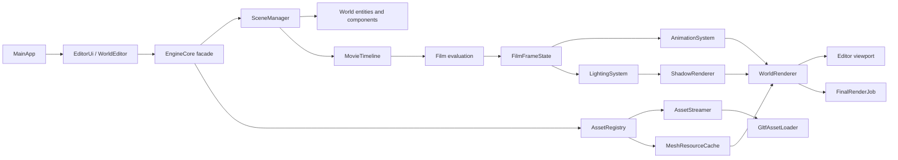
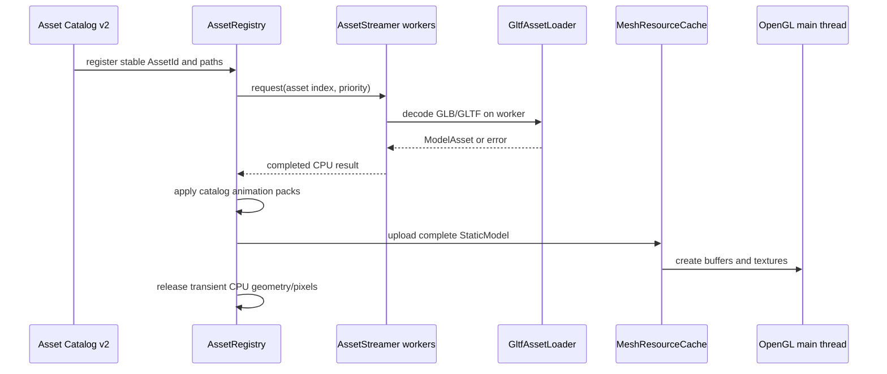
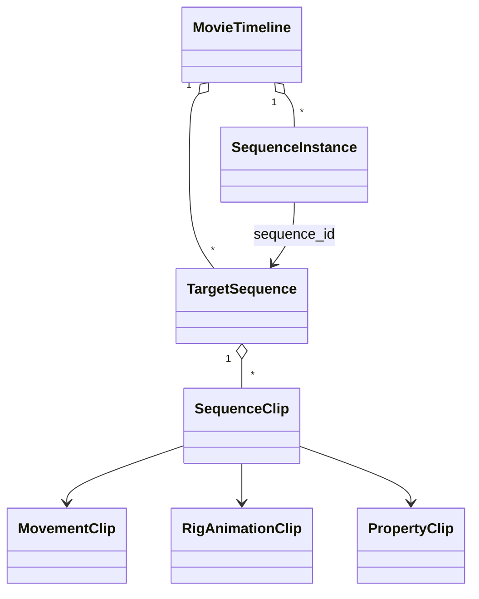
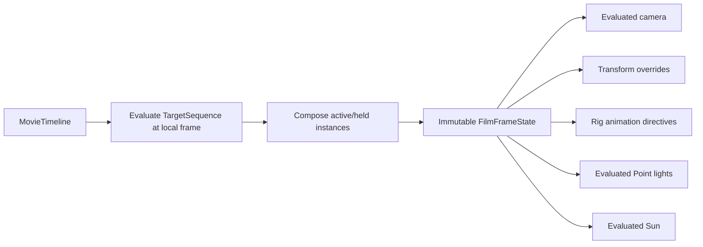

# KageEngine Architecture

## 1. Architectural goals

KageEngine is a purpose-built cinematic editor and renderer. Its architecture
is intentionally limited to the project’s cinematic production workflow:

- World Edit authors persistent scene state.
- Movie Edit schedules reusable, target-specific animation without mutating the
  authored World.
- Runtime asset loading keeps CPU decoding off the render thread while all
  OpenGL creation remains on the main thread.
- Preview and Bake consume the same evaluated film state.
- Persistent identities use stable IDs; transient GPU resources use asset
  library indices.
- Invalid film state is diagnosed before Bake instead of being repaired
  implicitly.

## 2. System overview

```mermaid
flowchart LR
    App[MainApp] --> UI[EditorUi / WorldEditor]
    UI --> Core[EngineCore facade]

    Core --> Scenes[SceneManager]
    Scenes --> World[World entities and components]
    Scenes --> Movie[MovieTimeline]

    Core --> Registry[AssetRegistry]
    Registry --> Streamer[AssetStreamer]
    Streamer --> GLTF[GltfAssetLoader]
    Registry --> MeshCache[MeshResourceCache]

    Movie --> Eval[Film evaluation]
    Eval --> Frame[FilmFrameState]
    Frame --> Anim[AnimationSystem]
    Frame --> Light[LightingSystem]
    Anim --> Renderer[WorldRenderer]
    Light --> Shadows[ShadowRenderer]
    MeshCache --> Renderer
    Shadows --> Renderer
    Renderer --> Preview[Editor viewport]
    Renderer --> Export[FinalRenderJob]
```

`EngineCore` is the application facade. It wires subsystems together and exposes
editor commands, but domain rules remain in their owning modules: scene
ownership in `scene`, film rules in `film`, asset loading in `assets`, and GPU
submission in `render`.

## 3. Scene and editor ownership

### SceneManager

`SceneManager` owns a list of `SceneRecord` values. Each record contains:

- a `World`;
- the selected World entity;
- one directional Sun configuration;
- one `MovieTimeline`;
- a scene name.

Persistent scenes are stored in the World file. The local session stores only
editor state such as the editor camera, active scene, selection, playhead, grid
settings, material-debug mode, and gizmo axis space; it is not film content.

### World

`World` owns stable `EntityId` records. Components are deliberately small:

- `TransformComponent`;
- `StaticMeshComponent` with an asset-library index and local bounds;
- `RigComponent`;
- `CameraComponent`;
- `LightComponent`, representing a Point light;
- `NameComponent`.

The directional Sun is scene state rather than an entity. Entity deletion uses
stable IDs so Movie targets can be detected as orphaned instead of silently
retargeted.

### Editor responsibilities

`EditorUi` draws the World panels and dispatches explicit commands to
`EngineCore`. `WorldEditor` coordinates navigation, selection, placement,
gizmos, and rendering. Movie-specific selection is separate from World
selection.

ImGui code does not own Movie timing, overlap, continuity, or frame-limit rules.
Those operations are delegated to `TimelineEditService`.

## 4. Asset pipeline

```mermaid
sequenceDiagram
    participant Catalog as Asset Catalog v2
    participant Registry as AssetRegistry
    participant Streamer as AssetStreamer workers
    participant Loader as GltfAssetLoader
    participant Cache as MeshResourceCache
    participant GL as OpenGL main thread

    Catalog->>Registry: register stable AssetId and paths
    Registry->>Streamer: request(asset index, priority)
    Streamer->>Loader: decode GLB/GLTF on worker
    Loader-->>Streamer: ModelAsset or error
    Streamer-->>Registry: completed CPU result
    Registry->>Registry: apply catalog animation packs
    Registry->>Cache: upload complete StaticModel
    Cache->>GL: create buffers and textures
    Registry->>Registry: release transient CPU geometry/pixels
```

`projects/kage_no_kata_assets.kage.json` is the tracked Asset Catalog. Model and
environment entries have stable IDs. Runtime entities persist those IDs; after
load they resolve to compact asset-library indices.

The GLTF loader imports:

- meshes, indices, normals, tangents, UVs, colors, and materials;
- textures and sampler state;
- node hierarchy and transforms;
- skins, joints, inverse bind matrices, joint indices, and weights;
- embedded animation samplers and channels.

Compatible external animation GLBs are declared as catalog
`animation_packs`. When the base model finishes loading, the runtime validates
skeleton compatibility, remaps channels by joint name, and appends the selected
clips. There is no separate runtime “Import Animation” dialog.

`AssetStreamer` uses a bounded worker pool for decoding. GPU buffers and textures
are created only by the main thread. One complete `GpuMesh` and source-resolution
texture set is kept per loaded asset; the engine does not generate LODs or proxy
materials.

## 5. Movie domain

### Persistent model

Film time is represented as integer frames at 30 fps. Ranges are half-open
`[start_frame, end_frame)`, and the maximum exclusive film end is frame 3600.

```mermaid
classDiagram
    MovieTimeline "1" o-- "*" TargetSequence
    MovieTimeline "1" o-- "*" SequenceInstance
    TargetSequence "1" o-- "*" SequenceClip
    SequenceClip --> MovementClip
    SequenceClip --> RigAnimationClip
    SequenceClip --> PropertyClip
    SequenceInstance --> TargetSequence : sequence_id
```

A `TargetSequence`:

- belongs to one rigged entity, camera, Point light, or the Sun;
- starts at local frame zero;
- captures its target base state at creation;
- contains Movement, Rig Animation, or typed Property clips;
- derives its duration from its furthest clip end.

A `SequenceInstance` places one complete sequence on the Movie Timeline. The
same sequence can be reused without copying clips.

Authorable lanes are intentionally limited:

| Target | Lanes |
| --- | --- |
| Rigged entity | Movement, Animation |
| Camera | Movement, FOV |
| Point light | Movement, Intensity, Color |
| Sun | Direction, Intensity, Color |

### Editing invariants

`TimelineEditService` applies edits to a candidate copy, validates the result,
and commits only valid state. It owns:

- stable sequence, instance, and clip ID allocation;
- lane compatibility and same-lane overlap rules;
- movement continuity and optional gap transitions;
- instance overlap rules;
- the 3600-frame boundary;
- atomic append, duplicate, move, trim, and delete operations.

Camera overlaps remain editable so a user can repair them, but they are
diagnosed and block Bake. Same-target non-camera overlaps are rejected.

### Evaluation boundary

```mermaid
flowchart LR
    Timeline[MovieTimeline] --> Local[Evaluate TargetSequence at local frame]
    Local --> Compose[Compose active/held instances]
    Compose --> State[Immutable FilmFrameState]
    State --> Camera[Evaluated camera]
    State --> Transforms[Transform overrides]
    State --> Rigs[Rig animation directives]
    State --> Lights[Evaluated Point lights]
    State --> Sun[Evaluated Sun]
```

`FilmFrameState` is the only Movie-to-runtime boundary. It contains typed,
evaluated camera, transform, rig-animation, Point-light, and Sun state. Runtime
systems do not search timeline clips.

Evaluation starts from each sequence’s captured base. Empty intervals hold the
previous evaluated value. Before the first rig clip the character uses bind
pose; after a non-looping clip it holds the final sampled pose. Camera gaps use
the authored Hold or Black policy.

World values are never rewritten during preview or Bake. Stopping preview
simply stops consuming `FilmFrameState`, so normal World rendering resumes
without a restoration pass.

## 6. Skeletal animation

`GltfAssetLoader` imports the skeleton and clip data. `Animator`:

- creates bind poses from GLTF nodes;
- samples translation and scale linearly;
- samples rotation with normalized spherical interpolation;
- builds global node transforms;
- computes skin matrices from global joint transforms and inverse bind
  matrices.

`AnimationSystem` resolves clips by stable `AnimationClipId`, samples the
trimmed source interval with speed and loop settings, and builds a palette for
each skinned primitive. GPU shaders apply up to the configured joint-palette
limit.

The code contains a reusable pose-blending operation and blends from the bind
pose to the selected sampled pose. The Movie workflow does not automatically
cross-fade between adjacent animation clips.

## 7. Lighting and shadows

`LightingSystem` combines authored World lighting with optional typed film
overrides. It produces one directional Sun and a bounded list of Point lights.
Shadow-enabled Point lights are ranked deterministically by camera influence,
with entity ID as the tie-breaker.

`ShadowRenderer` generates:

- one stabilized directional depth map;
- up to two omnidirectional Point-light cubemap depth maps.

Material preview uses a broad 2048² Sun footprint. Final viewport and film
export use a tighter 4096² footprint while retaining the broader depth coverage.
This improves nominal world-space texel density without adding cascaded-shadow
complexity. Point-light shadows use 1024² faces. Alpha-masked and double-sided
materials participate in the depth passes.

Directional Sun shadows and the small filtering kernel support the rendering
pipeline alongside the Point-light cubemap shadows. Feature ownership and claim
boundaries are maintained in
[Project Scope and Evidence](PROJECT_SCOPE_AND_EVIDENCE.md).

## 8. Rendering pipeline

`WorldRenderer` coordinates the viewport and export passes:

1. select the editor or evaluated film camera;
2. obtain evaluated animation palettes and lighting;
3. collect visible draw items and shadow casters;
4. render Sun and selected Point-light depth maps;
5. render environment and opaque/masked geometry;
6. render blended geometry back-to-front without depth writes;
7. render editor-only debug primitives and gizmos when enabled;
8. resolve the film framebuffer and tone-map to the destination.

Viewport modes are:

- **Bounds** — bounds and editor diagnostics;
- **Solid** — complete geometry without material texturing;
- **Material** — materials, environment, lighting, and broad Sun shadow;
- **Final** — full materials, tighter high-resolution Sun shadow, and Point
  shadows.

All mesh modes use the complete authored geometry. `DebugPrimitiveRenderer`
shares one dynamic vertex pipeline for editor lines and solid overlays.
`MeshResourceCache` indexes GPU resources directly by the transient asset-library
index.

## 9. Film export

`FinalRenderJob` validates the timeline before allocating output resources.
It renders one overlay-free 3840×2160 frame per application frame at 30 fps,
writes a numbered PNG sequence and manifest, and invokes `ffmpeg` only after all
frames succeed.

The encoder command uses H.264, `yuv420p`, and fast-start metadata. A failed GPU
setup, frame write, or encode moves the job to an explicit error state without
making the editor unusable.

## 10. Verification architecture

Headless system tests cover film semantics, atomic editing, persistence
round-trips, World-state immutability, lighting extraction, preview state, and
Bake validation. GPU appearance, full asset loading, UI interaction, and
encoding use the manual workflow in
[Build and Validation](BUILD_AND_VALIDATION.md). The source and validation
evidence attached to each feature is maintained in
[Project Scope and Evidence](PROJECT_SCOPE_AND_EVIDENCE.md).
