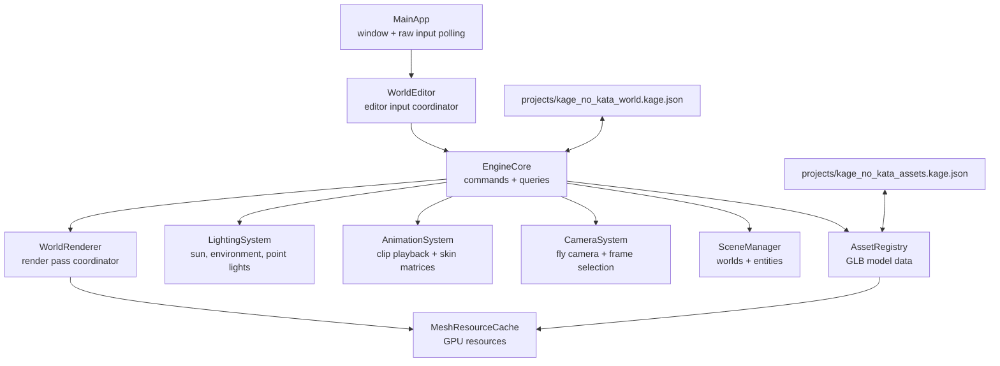

# Architecture

KageEngine is a small editor/runtime foundation for the film. Framework code
owns the window; project systems own behavior.

```mermaid
flowchart TD
    MainApp["MainApp\nwindow + raw input polling"]
    Editor["WorldEditor\neditor input coordinator"]
    Engine["EngineCore\ncommands + queries"]
    Assets["AssetRegistry\nGLB model data"]
    MeshCache["MeshResourceCache\nGPU resources"]
    Scenes["SceneManager\nworlds + entities"]
    Camera["CameraSystem\nfly camera + frame selection"]
    Animation["AnimationSystem\nclip playback + skin matrices"]
    Lighting["LightingSystem\nsun, environment, point lights"]
    Renderer["WorldRenderer\nrender pass coordinator"]
    Catalog["projects/kage_no_kata_assets.kage.json"]
    World["projects/kage_no_kata_world.kage.json"]

    MainApp --> Editor --> Engine
    Engine --> Assets --> MeshCache
    Engine --> Scenes
    Engine --> Camera
    Engine --> Animation
    Engine --> Lighting
    Engine --> Renderer --> MeshCache
    Catalog <--> Assets
    World <--> Engine
```

## Ownership Rules

- UI sends commands; it does not mutate scene records directly.
- Assets store parsed source data. Render owns GPU buffers and textures.
- Scene data uses stable entity ids and stable asset ids.
- Animation samples skeleton clips into `SkeletonPose` and writes skin palettes.
- Lighting stores one scene sun, environment values, and point light entities.
- The editor camera is a fly camera; framing moves the camera to a selected
  bounds without changing grid or view-distance settings.

## Performance Architecture

- Asset CPU imports are bounded to two workers; GPU uploads remain on the
  context-owning main thread.
- Static glTF primitives are flattened and merged by material before GPU
  upload. Meshoptimizer prepares vertex-cache-friendly indices plus 50% and
  15% index-only LODs.
- The renderer frustum-culls entity bounds and selects LOD from projected
  screen size. Rigged meshes stay at full detail.
- OpenGL validation is enabled only in Debug builds. Editor builds default to
  RelWithDebInfo and do not pay for a `glGetError` after every API call.
- Runtime Diagnostics reports submitted draws, triangles, and culled entities.

## Persistence

Tracked project data:

- `projects/kage_no_kata_assets.kage.json`
- `projects/kage_no_kata_world.kage.json`

Private editor state:

- `.kage_local/editor_session.json`
- `.kage_local/imgui.ini`

The local session also owns the viewport mode; it is not shared project data.

`Save Project` writes tracked world data. Autosave writes local editor state.
