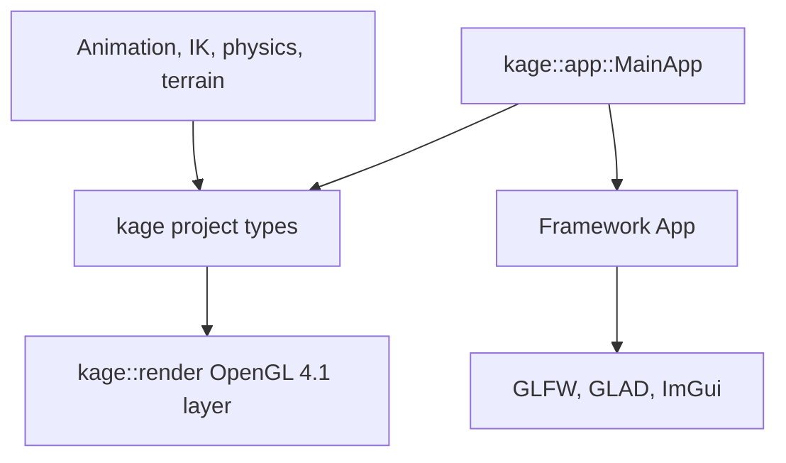

# University Framework Boundary

## Decision

The project uses `julcst/gltemplate` v1.7b as a platform bootstrap for windowing,
OpenGL loading, events, and ImGui. Project-owned code implements rendering
resources, assets, animation, simulation, timing, and runtime paths.

This boundary preserves the framework's platform setup while giving the runtime
one explicit OpenGL 4.1 implementation on macOS and Windows.

Project types follow the [root and domain namespace policy](CODE_STYLE.md#namespaces).

## Source Review

| Finding | Project decision |
| --- | --- |
| [`App`](https://github.com/julcst/gltemplate/blob/v1.7b/src/framework/app.cpp) owns GLFW, the OpenGL context, GLAD, ImGui, events, and buffer swapping. | Keep `App` behind the application boundary. |
| The [framework target](https://github.com/julcst/gltemplate/blob/v1.7b/src/framework/CMakeLists.txt) enables `MODERN_GL` on every non-Apple platform, selecting OpenGL 4.6 and DSA calls on Windows. | Apply a versioned compatibility patch that selects OpenGL 4.1 on both targets. |
| [`Program`](https://github.com/julcst/gltemplate/blob/v1.7b/src/framework/gl/program.cpp) sets uniforms through `glProgramUniform*`, which conflicts with the project's tested stability constraints. | Implement `kage::render::ShaderProgram` with bind-to-edit uniform updates. |
| [`Mesh`](https://github.com/julcst/gltemplate/blob/v1.7b/src/framework/mesh.hpp) provides fixed float-only vertex layouts, one index format, and whole-mesh triangle draws. | Implement static and skinned GPU meshes for glTF primitives, integer joints, materials, ranges, and instancing. |
| [`UniformBuffer`](https://github.com/julcst/gltemplate/blob/v1.7b/src/framework/uniformbuffer.hpp) relies on the caller matching GPU layout rules. | Implement explicit buffer layouts with alignment declarations and size checks. |
| The [dependency script](https://github.com/julcst/gltemplate/blob/v1.7b/cmake/FetchDependencies.cmake) can use system packages and downloads STB from a moving branch. | Pin every submission dependency and make submission builds independent of system package versions. |
| The generated [context helper](https://github.com/julcst/gltemplate/blob/v1.7b/src/framework/context.hpp.in) changes resource behavior between Debug and Release. | Resolve resources through a project-owned executable-relative path service. |

The framework uses RAII and move-only ownership for its OpenGL handles. Our GPU
types retain those principles while implementing the required data layouts and
OpenGL calls directly.

## Ownership

| Capability | Owner |
| --- | --- |
| GLFW initialization and native window | Framework |
| OpenGL context and GLAD initialization | Framework |
| Event polling, resize callbacks, and buffer swapping | Framework |
| ImGui initialization and rendering | Framework |
| Application state and input mapping | Project |
| Simulation and offline-render clocks | Project |
| Runtime resource paths | Project |
| Shader programs and uniforms | Project |
| Buffers, vertex arrays, textures, and render targets | Project |
| Static, skinned, and instanced meshes | Project |
| glTF parsing and GPU upload | Project with approved `tinygltf` parsing |
| Animation, procedural strikes, IK, physics, and particles | Project |
| Audio playback and event integration | Project with approved `miniaudio` playback |

Framework camera, mesh, program, uniform-buffer, texture, framebuffer, OBJ, and
context helpers remain outside the production architecture.

## Dependency Direction

Only `kage::app::MainApp` inherits from `App` and translates framework callbacks
into project input and lifecycle state. Public interfaces in rendering, assets,
animation, physics, and scene systems expose project or standard-library types.

GLAD supplies the OpenGL declarations used by `kage::render`; this dependency is
an API loader rather than a dependency on framework resource classes.

## Project Rendering Layer

Rendering types are introduced when an integrated milestone requires them:

| Type | Responsibility |
| --- | --- |
| `kage::render::GpuBuffer` | Own one OpenGL buffer and upload typed byte ranges. |
| `kage::render::VertexArray` | Own one VAO and define float or integer attributes. |
| `kage::render::ShaderProgram` | Compile, link, bind, cache locations, and update uniforms. |
| `kage::render::Texture2D` | Own texture storage, sampling state, and image upload. |
| `kage::render::RenderTarget` | Own framebuffer attachments and validate completeness. |
| `kage::render::GpuMesh` | Own vertex/index storage and draw static or skinned glTF primitive ranges. |

Each type uses OpenGL 4.1 bind-to-edit functions and move-only RAII ownership.
GPU objects are destroyed while the framework context remains current.

## Compatibility and Reproducibility

The framework archive remains pinned to v1.7b with a SHA-256 hash. FetchContent
uses `cmake/PatchGltemplate.cmake` to select the shared OpenGL 4.1 path and fix
dependency revisions. The CMake patch step is reviewed whenever the framework
revision changes.

Release inputs use exact dependency revisions. Build configuration records the
framework archive hash and avoids silent substitution with system packages.
Runtime assets resolve relative to the packaged executable layout through
`kage::platform::RuntimePaths`.

## Migration Property

Replacing the framework requires a new platform host for window, context, input,
and ImGui lifecycle. Rendering and domain systems remain reusable because their
public interfaces contain no framework resource types.

## Acceptance

- Debug and Release builds create an OpenGL 4.1 Core Profile context on macOS
  and Windows.
- The first triangle uses project-owned shader, buffer, and vertex-array types.
- Project rendering code contains the bind-to-edit calls defined by the
  [Code Style](CODE_STYLE.md#opengl-guidelines).
- Packaged execution resolves shaders, models, textures, audio, and output paths
  through `RuntimePaths`.
- Static and skinned meshes share the project rendering layer.
- Framework headers remain confined to the application integration boundary.
