# Project Report — Kage no Kata: The Final Cut

## 1. From an interactive scene to a film-making engine

Kage no Kata began as a small interactive scene: a Shinobi prepares a precise
cut at a bamboo target, and the player's input determines the technique,
timing, fracture, effects, and final pose. The original technical plan therefore
included a cut-evaluation system, deterministic bamboo response, particles,
audio, and a compact character state flow.

Very early implementation changed the real problem. Before we could make a
convincing cut, we had to make the university framework capable of targeting
macOS and Windows, load a Blender asset, understand its data, render it, inspect it, place
it in a scene, animate it, light it, and finally capture a repeatable film. The
tooling needed to make the story became a larger and more demanding project than
the initially planned interaction. The delivered result is therefore a focused
C++23/OpenGL cinematic-authoring engine and film workflow rather than an
interactive bamboo-cut application.

This report describes that development process as well as the finished system.
The detailed feature-claim boundary, source locations, and validation inventory
remain in [Project Scope and Evidence](PROJECT_SCOPE_AND_EVIDENCE.md).

## 2. What changed and why

| Original intention | Delivered direction | Why the direction changed | Status |
| --- | --- | --- | --- |
| A player-controlled bamboo cut whose input affects the action and result | A deterministic World and Movie authoring workflow for filming the Samurai scene | A usable asset, camera, scene, animation, and export pipeline had to exist before interactive mechanics could be evaluated in a finished shot | Deferred, not presented as an implemented feature |
| Segmented bamboo fracture, particles, and impact effects | GLB asset loading, skeletal playback, lighting, shadows, and film export | The rendering and authoring foundation consumed the available technical scope | Deferred |
| Reactive sound and audio layering | Visual film workflow with frame rendering and MPEG4 encoding | Sound is an allocated contribution but is not an evidenced engine claim in the current submission state | Evidence pending |
| A small collection of scene-specific code | Reusable World, Movie, sequence, persistence, and Bake systems | Repeated production needs made isolated scene code too fragile and led to an engine-like structure | Implemented |

The change was not a claim that the original idea was impossible. It was a scope
decision: we chose to finish a smaller, reproducible production path rather than
describe unfinished interaction, physics, particles, or audio as completed
features.

## 3. Development history

| Phase | Evidence | Development result and lesson |
| --- | --- | --- |
| 1. Standards and platform baseline | `550359f`, `5e45f3b`, `508508c` | We set code-style and portability rules, created the application baseline, and made framework patching deterministic. The supplied framework's non-Apple path selected a newer OpenGL/DSA configuration than our shared OpenGL 4.1 target, so the project needed its own compatibility boundary rather than using framework render helpers unchanged. |
| 2. First asset pipeline | `9c47682`, `86fa392`, `fff8f71`, `19703cf`, `7c29a69` | We pinned `tinygltf`, resolved runtime paths, decoded static GLBs, created project-owned GPU primitives, and rendered the Sword and Torii Gate. This was the first moment when Blender output appeared in the runtime. |
| 3. Inspection became editing | `a63bec2` | A model in an empty viewport was not enough to build the story. Camera controls, light controls, selection, gizmos, ImGui diagnostics, persistence, and World editing were added so that assets could be inspected and composed. |
| 4. Rigging exposed architectural debt | `4ef8af1`, `4ed1c68`, `dfc7794` | Skin data, inverse bind matrices, pose sampling, palette upload, and animation playback entered the same codebase. The first implementation required a major architecture repair and redundancy cleanup before a working animation could be validated. |
| 5. Building a real world | `68bc1d2`, `c515381`, `8133282` | More assets and a Blender-like viewport made loading and render-path cost visible. We restructured hot paths, introduced streaming and resource caches, and separated CPU decoding from main-thread OpenGL work. |
| 6. Movie authoring was separated from World authoring | `6b422e3`, `785ad73`, `616ef7e`, `2f546d7` | Timeline code could no longer safely share responsibility with the persistent World. We introduced isolated movie data, then replaced legacy timeline paths with target sequences, placed instances, persistence, editor views, and validation. |
| 7. Consolidation before submission | `24db90c`, `88ce25a`, `3e755a5`, `bbf1821`, `ec8c873` | Typed frame evaluation, shared movement resolution, playback-state consolidation, shadow settings, and mesh-pass cleanup turned repeated rules into explicit subsystem boundaries. |

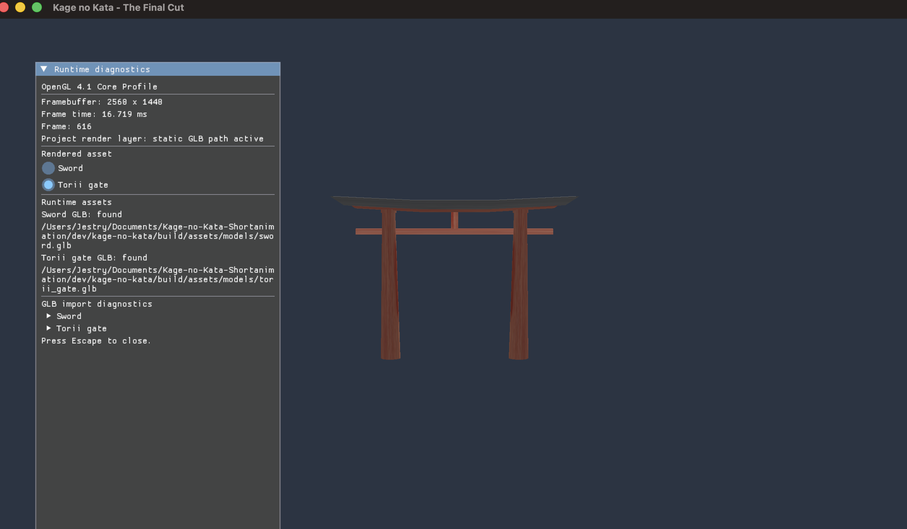

*Figure 1. First record of the static-asset pipeline. It demonstrates why asset diagnostics and project-owned rendering were needed before the film could be authored.*

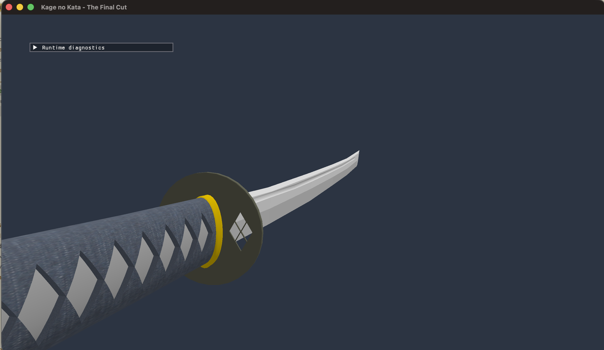

*Figure 2. First record of camera-driven asset inspection. Close inspection made scale, orientation, material, and framing problems visible while the editor was still minimal.*

## 4. Problems that shaped the implementation

### 4.1 The framework was a starting point, not a complete rendering layer

The university framework supplied the window, context, event loop, and ImGui
lifecycle, but its graphics assumptions could not simply become the engine's
assumptions. In particular, the intended macOS/Windows compatibility target was
OpenGL 4.1 Core, while the framework's non-Apple configuration selected a newer
OpenGL path and direct-state-access calls. We patched the framework setup
deterministically and built project-owned shader, buffer, vertex-array, texture,
and mesh types around the compatible bind-to-edit API.

This took time before a visible feature existed, but it removed a recurring
platform risk. It also explains why apparently basic work—opening a window,
updating a uniform, or locating a packaged asset—became part of the project
rather than background setup.

### 4.2 GLB import was an interpretation and validation problem

The first pipeline deliberately supported a narrow subset of glTF: static
geometry, material data, and one texture-coordinate set. The current loader
rejects materials that select anything other than `TEXCOORD_0`. This was a
conscious complexity boundary, not a general glTF implementation: many library
assets expose a second UV set, so assets had to be checked and, when necessary,
prepared in Blender before use.

The pipeline then expanded because a rigged character needs more than vertex
positions: nodes, skins, joints, inverse bind matrices, joint indices, weights,
and animation channels must agree. Runtime paths, catalog identity, import
errors, and later asynchronous decoding were all consequences of making Blender
exports dependable enough for scene authoring.

### 4.3 We had to build tools to see the work

After the first import, the runtime was mostly a void containing a sword and a
small camera controller. To diagnose an asset and compose a shot, we needed a
camera, lights, selection, transform gizmos, an editor UI, and runtime
diagnostics. ImGui became the practical interface for this exploration and was
retained as the editor UI foundation.

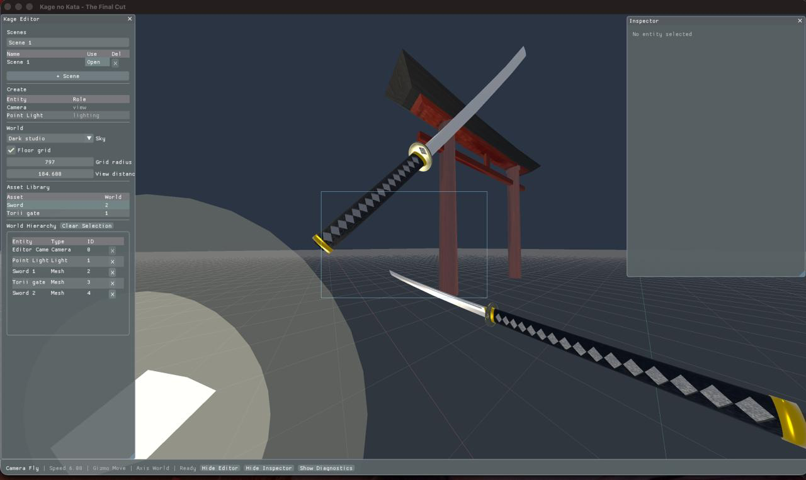

*Figure 3. First record of the World-builder milestone. The imperfect composition is useful evidence: the editor was being created to make asset placement and inspection possible.*

### 4.4 Skeletal animation was not just “play a clip”

The Samurai introduced hierarchy traversal, sampled translation/rotation/scale
channels, bind-pose construction, weighted vertices, per-primitive joint
palettes, and GPU skinning. Early playback and editor records show that a clip
or control panel existing did not make the full visual result correct. The white
silhouette and incomplete material appearance in the early record below are
retained deliberately: they show an intermediate integration state, not an
achievement being claimed as final output.

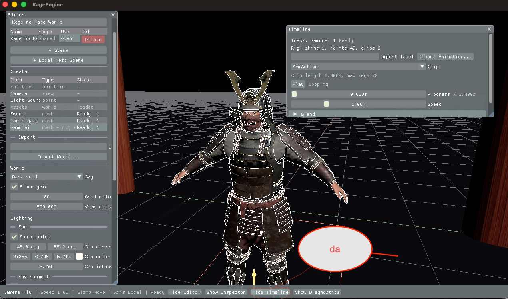

*Figure 4. First record of animation playback. It documents the gap between obtaining a rigged pose and integrating it correctly with the complete material and render path.*

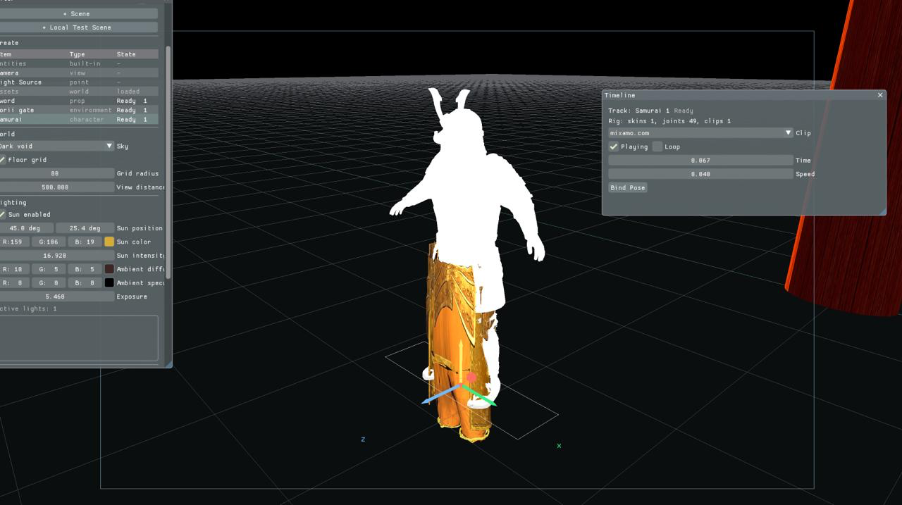

*Figure 5. First record of animation authoring controls. This preceded the later World/Movie separation and therefore records a useful but still coupled iteration of the workflow.*

### 4.5 Timeline work repeatedly exposed ownership problems

As camera, movement, animation, and lighting were added, the timeline was no
longer a small UI feature. Playback needed to override values temporarily,
without destroying the authored World. Reuse also required a sequence to be
separate from its placement in the master Movie. These concerns caused a large
restructure: World Edit retains persistent scene data; a Target Sequence owns
one target's local authoring data; a Sequence Instance places that complete
sequence in Movie time; evaluation produces an immutable `FilmFrameState`.

The later cleanup was therefore not cosmetic. Central validation, typed
evaluation, and one shared movement resolver replaced duplicated state and
timeline rules that had accumulated while the feature was being discovered.

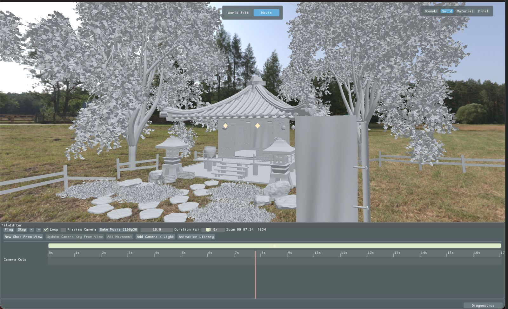

*Figure 6. First record of the Movie Timeline. It marks the transition from an editor with local playback controls to an explicit film-authoring workflow.*

## 5. Final assessed contributions

The final engine is specialized for making this film. It is not presented as a
general-purpose engine; its value is that the completed production path has
consistent state ownership from import through export.

### Julian Meyer — Cinematic Engine

Julian implemented the persistent World and Movie workflow: asset catalog and
loading, World editing, reusable target-specific sequences and master
placements, movement and camera authoring, preview, validation, save/reload,
and frame-based Bake. This contribution is the result of the timeline work in
phases 5–7, not an original single-feature implementation.

`MovieTimeline` evaluates stable target and clip IDs into typed
`FilmFrameState` output. Render, camera, lighting, and animation consume that
output without writing evaluated values back to the World. Preview and Bake
therefore use the same evaluation path.

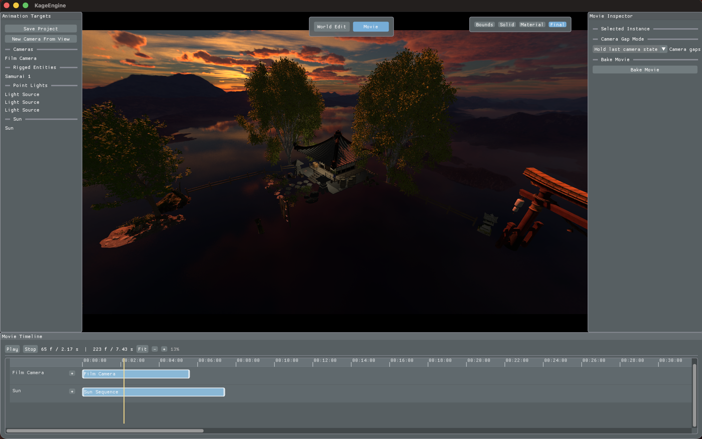

*Figure 7. Final Movie Editor. In contrast to Figures 5 and 6, the target list, inspector, timeline, preview, and validation workflow are separated into dedicated views.*

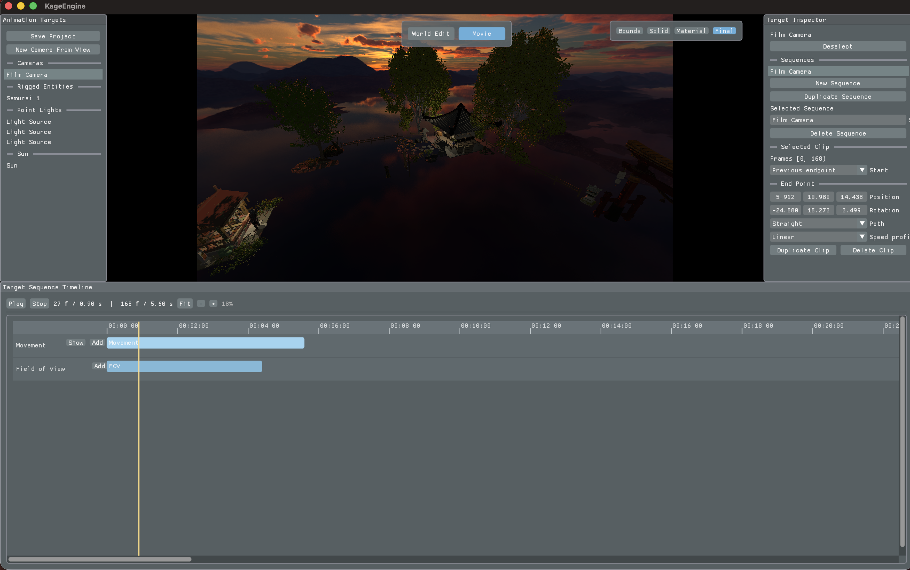

*Figure 8. Final timeline views. A target sequence owns reusable local data; a sequence instance places the complete sequence on the master Movie timeline.*

### Julian Meyer — Rigging and Blending contribution

Julian's evidenced contribution covers GLTF skin and animation import, stable
clip identity, TRS sampling, bind-pose construction, pose-blending
infrastructure, per-primitive palettes, GPU skinning, and Movie-controlled
playback. The current Movie evaluator selects authored rig clips and supports
the documented trim, speed, loop, and final-pose behavior; automatic
cross-fades between adjacent Movie clips are outside this claim.

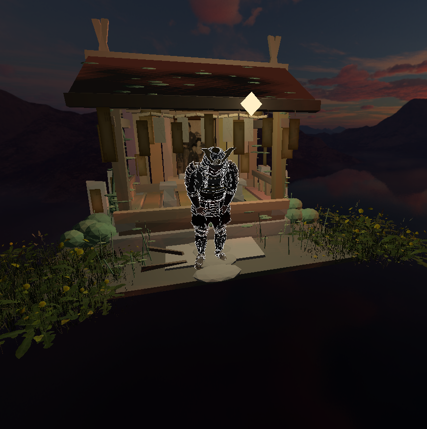

*Figure 9. Final rigging/animation result. It contrasts with the intermediate records in Figures 4 and 5 by showing the rigged character integrated into the finished render workflow.*

### Julian Meyer — Point-light Shadow Mapping

Julian implemented omnidirectional point-light shadow mapping with depth
cubemaps, six depth faces per selected light, deterministic selection of at most
two shadow-enabled Point lights, and support for alpha-masked, double-sided, and
skinned casters. The bounded selection is an explicit performance trade-off:
additional Point lights remain illuminated but do not receive a shadow slot.

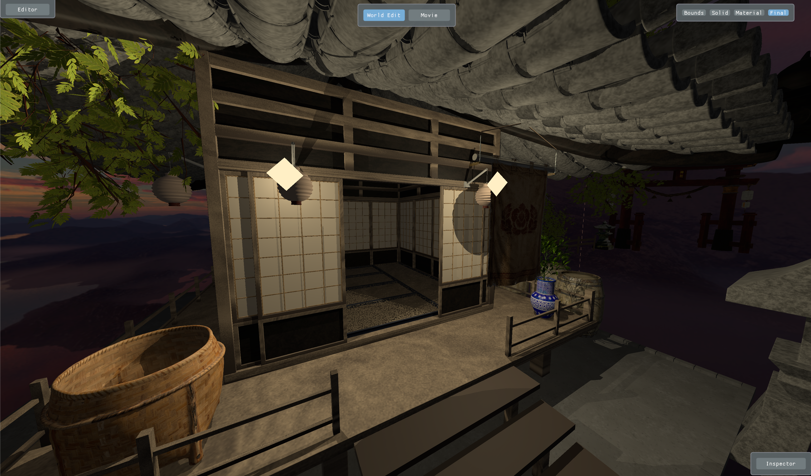

*Figure 10. Point-light shadow result. This demonstrates the final spatial-shadow capability rather than treating the supporting renderer as a separate feature claim.*

### Bake and reproducible output

After validation, Bake renders overlay-free numbered PNG frames at 3840 × 2160
and 30 fps, writes a manifest, and invokes `ffmpeg` only after the frame sequence
succeeds. The important result is not only an encoded MPEG4 file: invalid movie
state and encoding failures are reported without silently changing the authored
World.

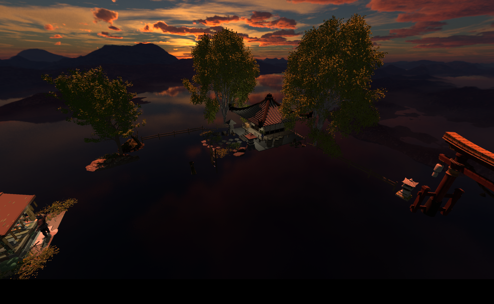

*Figure 11. Bake output. The frame sequence and encode stage complete the same production path used in preview.*

## 6. Contributions and evidence boundary

We use a team voice for shared decisions, but assessment claims need named,
reproducible ownership.

| Contributor | Reported responsibility | Evidence boundary |
| --- | --- | --- |
| Julian Meyer | Engine architecture, OpenGL compatibility work, GLB pipeline, World/Movie editor systems, animation integration, point-light shadows, validation, and Bake | The three evidenced claims above are specified in [Project Scope and Evidence](PROJECT_SCOPE_AND_EVIDENCE.md). |
| Faouzi Homsani | Created the Blender assets, rigged the Samurai, and authored every Samurai animation | This is the production-side half of the shared Rigging and Blending contribution. Its Blender-source, runtime-integration, film-use, and presentation evidence is recorded in [Project Scope and Evidence](PROJECT_SCOPE_AND_EVIDENCE.md). |

Faouzi's work was substantial: creating usable assets, learning Blender's rigging
and animation workflow, and producing all Samurai actions made the character
available to the engine. Julian's importer, runtime evaluation, and GPU skinning
are separate responsibilities. Motion Blur, Film Grain, Sound, and Procedural
Geometry remain pending allocations rather than claims in this report.

### Faouzi Homsani — reflection TODO

- Explain the Blender learning process and the decisions needed to make assets
  usable in the runtime pipeline.
- Describe the Samurai rig: skeleton setup, weighting/deformation checks, and
  the problems encountered while preparing it for animation.
- Explain the intention, reference, timing, and iteration behind every Samurai
  animation used in the film.
- Describe the export and handoff from Blender to GLB, including what had to be
  checked for successful runtime playback.
- Identify the most difficult artistic or technical problem, what would be
  improved with more time, and the exact film shots that demonstrate the work.

## 7. Critical reflection and limitations

### Shared reflection

The strongest decision was to narrow the project around a coherent authoring
path. This avoided claiming unfinished interaction and let us test a complete
chain: import assets, construct a World, author target sequences, place Movie
instances, preview, validate, save/reload, render frames, and encode a film.

The cost was repeated restructuring. Several systems first existed in a more
direct form, then had to be separated once their responsibilities became clear:
framework versus project rendering, CPU decode versus OpenGL upload, World
versus Movie state, local sequences versus master placements, and UI controls
versus validation rules. Those changes consumed time, but leaving the earlier
coupling in place would have made preview, persistence, and export less
trustworthy.

### Julian Meyer — personal reflection

Julian's main learning outcome was that graphics programming begins long before
an impressive frame. Rotating or framing an imported asset, interpreting glTF
accessors, choosing a small compatible OpenGL subset, or making a timeline stop
without corrupting a scene each required decisions across data ownership, math,
rendering, and user workflow. The commit history includes repairs and cleanup
because the architecture was discovered while the production requirements were
being implemented.

With more time, the next steps would be multi-UV material support, a less
bounded shadow budget, automatic animation transitions where the film needs
them, broader platform runtime verification, and a return to the original
interactive cut design. Those are extensions, not capabilities claimed by this
submission.

### Current limitations

- Rendering targets OpenGL 4.1 Core for macOS/Windows compatibility; runtime
  verification remains platform-dependent and must be checked manually on the
  final target machines.
- The material importer accepts `TEXCOORD_0` only; second UV sets require asset
  preparation or future loader work.
- At most two Point lights receive cubemap shadow slots at once.
- Adjacent Movie animation clips switch directly; automatic cross-fading is not
  claimed.
- Persistence is strict and current-version only; legacy-format migration is
  not a supported submission feature.
- Full GPU appearance, interactive UI behavior, complete asset loading, and
  external `ffmpeg` encoding still need the manual checks listed in
  [Build and Validation](BUILD_AND_VALIDATION.md).
- The submitted workflow has no interactive bamboo-cut algorithm, fracture
  simulation, particle system, or integrated evidenced sound feature.

## 8. Lessons learned

1. **A tool can become the project.** The systems needed to author and film the
   original scene became the most useful and technically substantial result.
2. **Compatibility constraints must shape the architecture early.** A framework
   can provide a host without providing the correct graphics contract for every
   target platform.
3. **Asset support needs explicit boundaries.** A small, validated subset is
   more honest and maintainable than claiming generic file-format support.
4. **Authored and evaluated state need different owners.** Immutable evaluation
   avoided restoration work and made preview and Bake agree.
5. **Cleanup is implementation work.** Consolidating state, ownership, and
   validation rules was necessary to turn experimental functionality into a
   reproducible workflow.

## 9. Reproducibility and submission check

[Build and Validation](BUILD_AND_VALIDATION.md) contains build commands, test
targets, persistence versions, manual checks, and output verification.
[Project Scope and Evidence](PROJECT_SCOPE_AND_EVIDENCE.md) remains the
authoritative claim manifest. Before submission, the final HTML/PDF rendering
of this report must be reviewed for figure size, captions, page breaks, and
working links, and every implementation-status entry must match the submission
commit.
