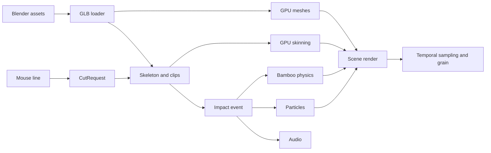

# Runtime Architecture

## Foundation

- C++23 and CMake 3.26+
- `julcst/gltemplate` v1.7b
- OpenGL 4.1 on macOS and Windows
- Blender-authored glTF 2.0 `.glb` assets
- `tinygltf` for parsing and `miniaudio` for playback, pending course approval

## Data Flow

## Runtime Systems

### Assets and Animation

`GltfAssetLoader` imports vertex attributes, indices, node hierarchy, inverse bind matrices, and animation channels. `Animator` linearly samples translation and scale, applies quaternion slerp to rotation, and cross-fades complete poses. The state sequence is:

`Idle -> LookAtPicture -> Kneel -> Draw -> AwaitCutInput -> Strike -> Recover`

Global joint transforms and inverse bind matrices produce up to 128 skinning matrices in a uniform buffer. `SkinnedVertex` stores position, normal, UV, four joint indices, and four weights.

### Bamboo Physics

Each bamboo segment stores mass, inertia, pose, linear velocity, and angular velocity. Joints connect the stalk. An impact releases the selected joint and applies a directional impulse. Semi-implicit Euler integration, damping, and ground contact update the fall.

### Procedural Terrain

Seeded fBm generates a height grid. Central differences calculate normals. Height and slope rules place grass, rocks, and bamboo through instanced rendering.

### Particles and Audio

A fixed particle pool simulates dust, fibres, and splinters with gravity, drag, wind, and lifetime. Instanced billboards render dust and fibres; mesh instances render splinters. Animation and scene events trigger wind, footsteps, sword, and bamboo samples.

### Film Rendering

The scene renders into floating-point color and depth targets. The film renderer evaluates eight times across each 30 FPS shutter interval and averages the subframes. The preview uses one sample. A final pass adds time-varying film grain.

Offline output supports `3840x2160`, fixed start and end frames, and numbered PNG files. A documented FFmpeg command encodes the MPEG4 submission.

## Portability

- `std::filesystem` builds resource paths.
- CMake lists every source and runtime resource.
- Shaders target `410 core`.
- Dependencies use pinned versions.
- Release tests run from the repository and packaged submission folder on both platforms.

## Acceptance

- A multi-action GLB loads its mesh, skeleton, and clips.
- Cross-fades maintain a continuous body pose.
- Three mouse angles produce distinct strikes.
- Equal seeds reproduce terrain and placement.
- Equal `CutRequest` values reproduce bamboo motion.
- Impact, particles, and audio share one simulation step.
- Offline rendering produces 2160p30 frames with eight temporal samples.
- Debug views expose skeletons, cut parameters, physics bodies, particle counts, and sample times.

## Course Confirmation

The team confirms `tinygltf` as a file parser, `miniaudio` as a playback backend, and segmented bamboo as the physical simulation feature. A course restriction on parsers activates a custom Blender Python exporter for versioned mesh, skeleton, and clip data.
